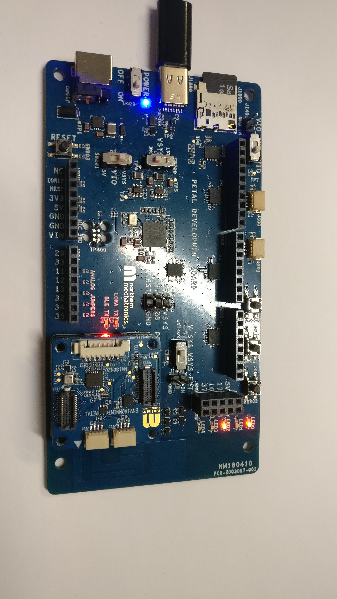
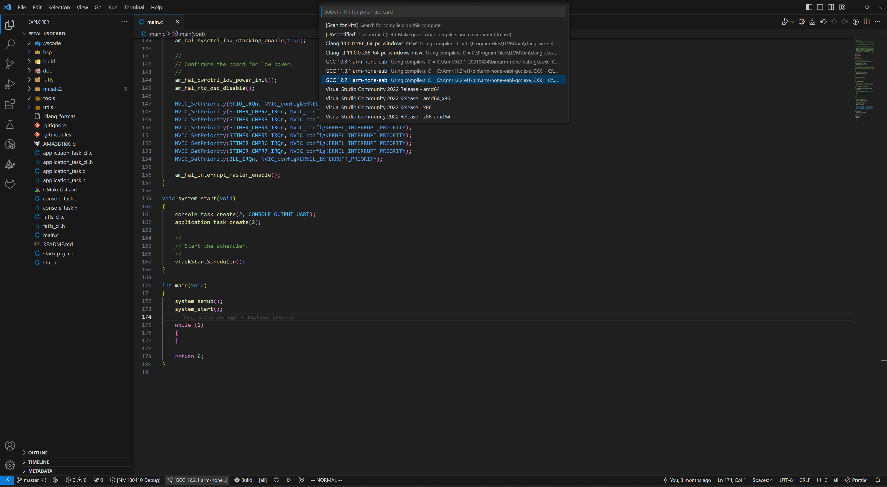
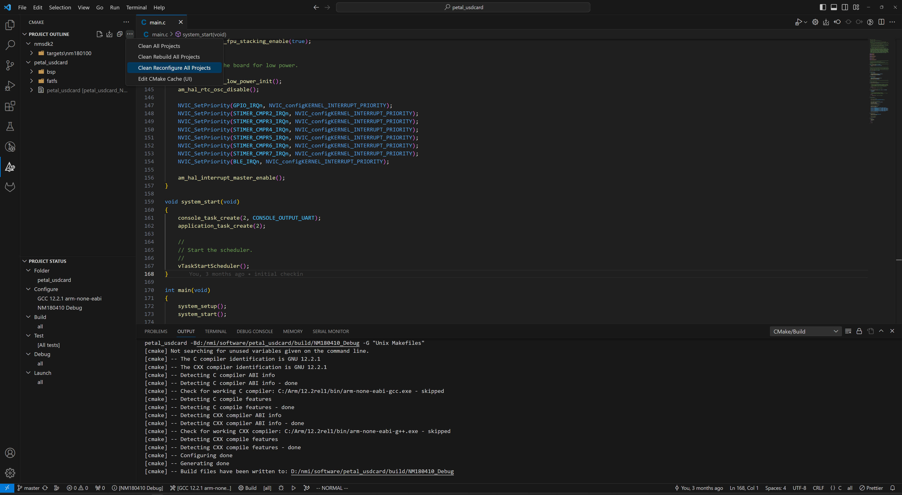
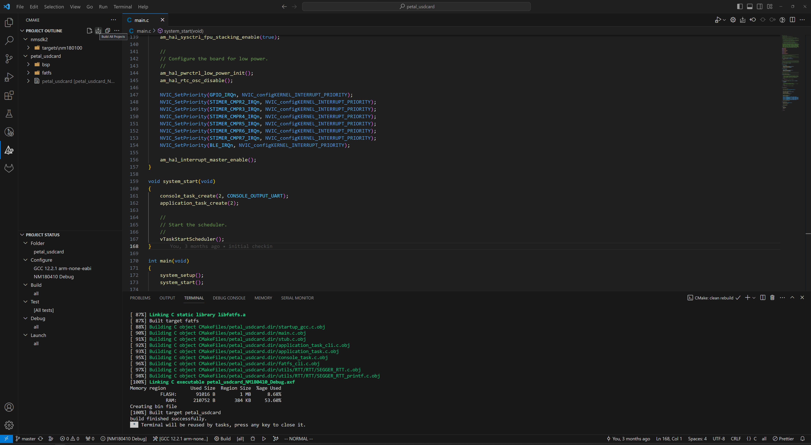
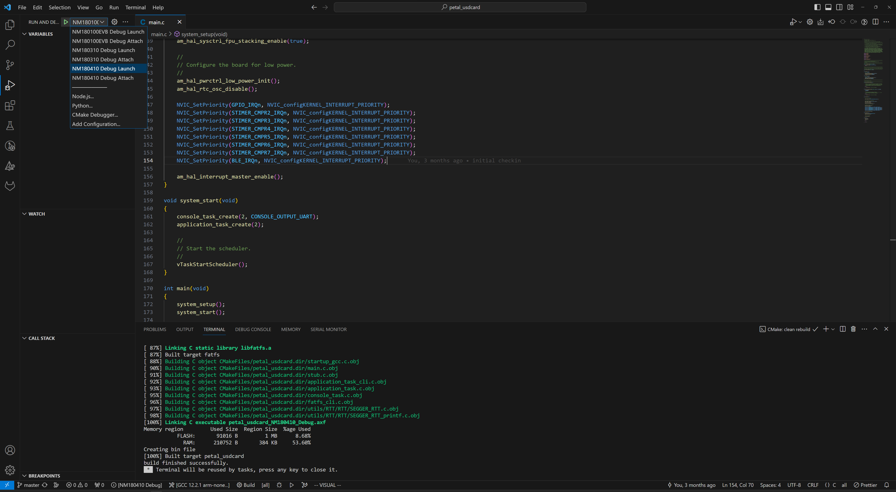
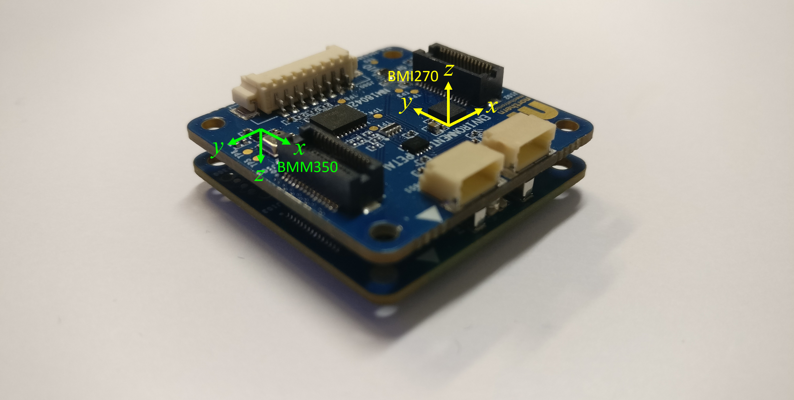
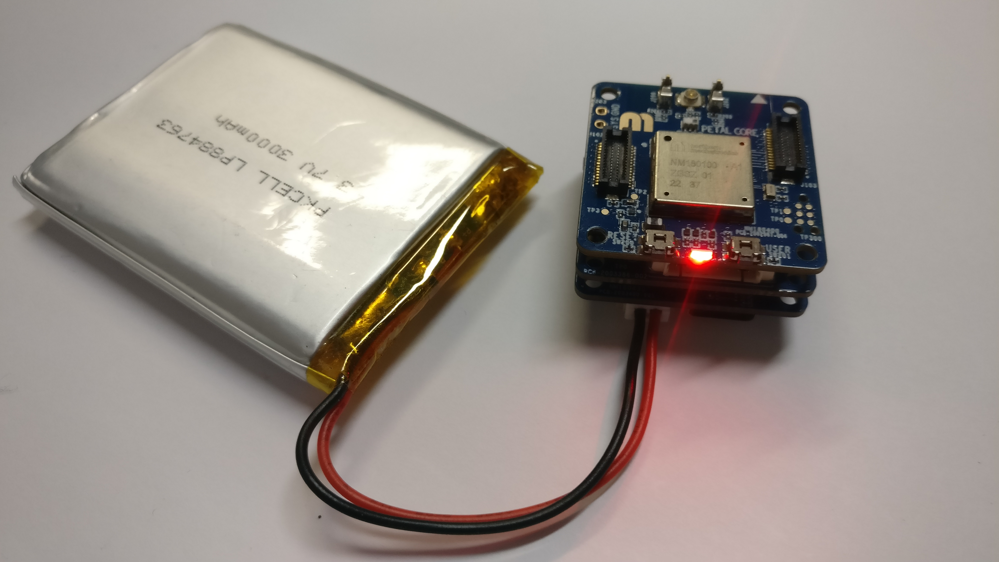

# IMU Petal Demo

## Introduction

This application demonstrates the use of the Bosch BMI270 IMU and the BMM350 magnetometer on
the IMU Petal add on board.  It also showcases the application of the CMSIS DSP APIs in signal
processing.

## Requirements

### Hardware

- A Petal Development Board
- A Petal Core Board
- A Petal IMU Board
- A USB C cable
- A Linux or Windows machine

### Software

- ARM GNU Toolchain Compiler
- pyOCD
- make
- cmake
- Python
- Visual Studio Code

## Quick Start

<b>Expand for detail steps</b>

1. Select the compiler version for your system as shown in the screenshot. If
   none appears in the list, try the `Scan for Kits` option or follow the
   <a href="https://github.com/NorthernMechatronics/nmapp2/blob/master/doc/getting_started.md">
   Getting Started</a> guide in nmapp2 to ensure that
   the ARM compiler is installed properly.
   

2. Select PETAL_IMU Debug or Release as the build variant.
   

3. Click the CMAKE extension icon in the Activity Bar on the left and
   in the primary sidebar, move your mouse cursor to Project Outline and click More
   Actions (denoted by the three dots ...) to expand the menu. Click on
   `Clean Reconfigure All Projects`.
   

4. Once the configuration process is completed, click on the Build All Projects
   icon in Project Outline. For a clean re-build, you can also select
   `Clean Rebuild All Projects`
   

5. Once the build is completed, click on Run and Debug in the Activity Bar on the left and
   select Petal IMU Debug or Release as the run variant.
   

6. Click the play button to load and run the program. Once the board is booted, you should
   see the following in a serial terminal.
   

## Hardware Description

The IMU Petal possesses a Bosch <a href="https://www.bosch-sensortec.com/products/motion-sensors/imus/bmi270/">BMI270</a> IMU with numerous builtin gesture and motion
detection capabilities. It also includes a Bosch
<a href="https://www.bosch-sensortec.com/products/motion-sensors/magnetometers/bmm350/">
BMM350</a> magnetometer useful for algorithms requiring absolute spatial orientation
measurement. The mappings of the axes for each sensor are illustrated in the figure below; showing the IMU Petal mounted onto the Core Petal.

## Firmware Description

This application provides a framework that the user can customized for specific
scenarios. The code is organized into three layers. The driver layer contains
driver code for both the IMU and the magnetometer and they are located in `bsp/drivers`.
Above the driver is the hardware abstraction layer which provides high-level
sensor configurations. These code are located under `motion`. Finally, the application
layer which consists of a set of files prefixed with `application_` in the root
directory of the project.

A number of features are provided in the application layer located in the directory
`application` to allow the user to quickly implement their solution:

- A serial command line interface allowing the user to interact with the system.
 
- In `application_task.c`, a message loop framework is provided to
  demonstrate how to sample, read, and utilise the sensor data. The
  sampling rate is adjustable by the API `application_setup_sensors`
  in `application_sensors.c` allowing the user to accommmodate different
  algorithm requirements.

- An example [shot detection algorithm](README.md#shot-detection-algorithm) is included
  to demonstrate how to work with this framework.

- Hard iron and isotropic soft iron calibration.

- Persistent storage solution for the magnetometer calibration data.
  This is implemented with the little filesystem (lfs).

- An example power savings implementation that make use of the no motion
  detection feature on the BMI270. When no motion is detected for more than
  2s, sampling is paused. Sampling is resumed as soon
  as motion occurs. The user can configure the definition of no motion in
  the function `imu_feature_config_no_motion` using the `no_motion_threshold`.
  This example uses a motion threshold of 16.8mg but it can be extended to 122mg
  if less sensitivity is required. User can also disable this feature by setting
  `sampling_always_on` to 1 in `application_task.c`.  One possible use case
  for this feature is for power savings.

- In the current implementation, only the interrupt1 pin is used on the
  BMI270. This can be modified in `imu_interrupt_config` located in
  `motion/imu.c`.

Regarding wireless communication, only the LoRaWAN communication stack is
enabled by default (`RAT_LORAWAN_ENABLE=ON`). To enable other radio access
technology (RAT) such as BLE, set `RAT_BLE_ENABLE` to `ON` in
`settings.json` in the `.vscode` directory for more details.

## Shot Detection Algorithm

The example shot detection algorithm was developed for achery bow to count the number of arrows that an archer had shot.
Detection is performed by convolving the incoming sampled accelerometer signal against a reference signal. A shot is
detected when the net power exceeds the given threshold.

At any given instance in time, the parameter of interest is the applied acceleration on the bow having a unit of $\text{m/s}^2$.

Thus, convolving two acceleration signals together will give rise to a quantity with unit $\text{m}^2/\text{s}^4$.

For a unit mass, we can define the energy transferred during a shot by integrating the convolved signal over the duration of the shot which gives us:

$$
\text{energy transferred} = \int \text{sampled} \circledast \text{reference} \\
= \int \int f(\tau)g(t - \tau)d\tau dt
$$

To perform this on the DSP, we transform the above into discrete form:

$$
\text{energy transferred} = \sum \text{sampled} \circledast \text{reference} \\
= \sum \sum_{m=-\infty}^{\infty} f[m]g[n-m]
$$

On the Apollo3 (Cortex-M4F) running at 48MHz, it takes approximately 600us to perform the following per time step over a 32 samples long signal:

- Euclidean distance
- Convolution
- Integration

Using energy transfer as a threshold is much more reliable compared to using
acceleration magnitude as it considers the temporal aspect of an impact event.
While the algorithm was originally designed to count the number of arrows an
archer shot, it can be useful in other areas of sport such as concussion
detection in althele.

## Prototype Field Deployment Consideration

The Petal development ecosystem is designed to allow users to quickly test their ideas and solutions in the field before
committing to mass production.  Northern Mechatronics offers a Power Petal that allows the user to power their device
using different battery chemistries such as primary cells or rechargeable lithium polymer cells.  Once firmware development
is completed on the Petal Development Board, the Core Petal and the IMU Petal can be unplugged and then re-attach to a Power
Petal for field deployment.  Below is an example of the Core Petal, IMU Petal, and the Power Petal stacked together and
powered by a rechargeable lithium polymer battery.

