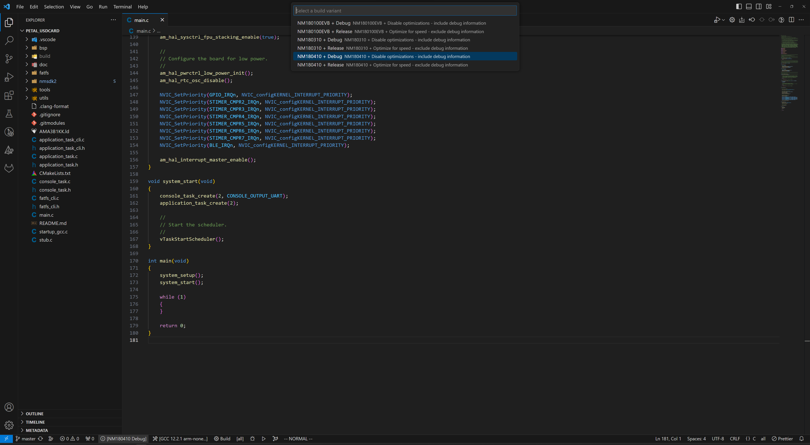
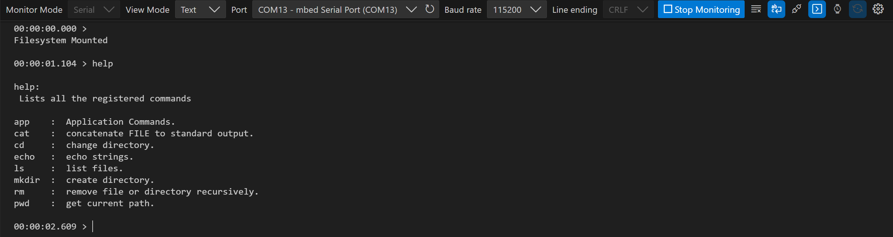

# Petal IMU Demo

## Introduction

This application demonstrates the usage of the Bosch BMI270 IMU and the BMM350 magnetometer on
the IMU Petal plugin board.

## Requirements

### Hardware

- A Petal Development Board
- A Petal Core Board
- A Petal IMU Board
- A USB C cable
- A Linux or Windows machine

### Software

- ARM GNU Toolchain Compiler
- pyOCD
- make
- cmake
- Python
- Visual Studio Code

## Quick Start

1. Select the compiler version for your system as shown in the screenshot. If
   none appears in the list, try the `Scan for Kits` option or follow the
   <a href="https://github.com/NorthernMechatronics/nmapp2/blob/master/doc/getting_started.md">
   Getting Started</a> guide in nmapp2 to ensure that
   the ARM compiler is installed properly.
   

2. Select PETAL_IMU Debug or Release as the build variant.
   

3. Click the CMAKE extension icon in the Activity Bar on the left and
   in the primary sidebar, move your mouse cursor to Project Outline and click More
   Actions (denoted by the three dots ...) to expand the menu. Click on
   `Clean Reconfigure All Projects`.
   

4. Once the configuration process is completed, click on the Build All Projects
   icon in Project Outline. For a clean re-build, you can also select
   `Clean Rebuild All Projects`
   

5. Once the build is completed, click on Run and Debug in the Activity Bar on the left and
   select Petal IMU Debug or Release as the run variant.
   

6. Click the play button to load and run the program. Once the board is booted, you should
   see the following in a serial terminal.
   

