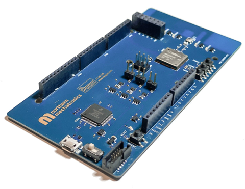
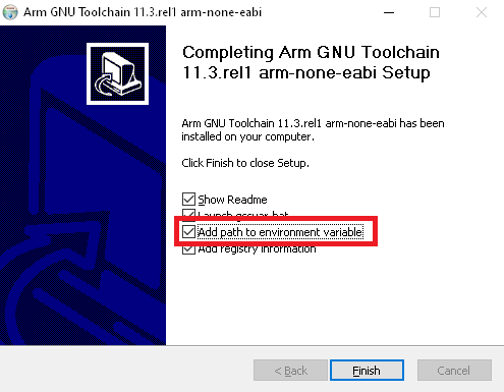
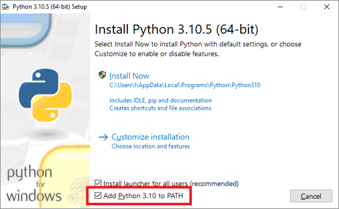
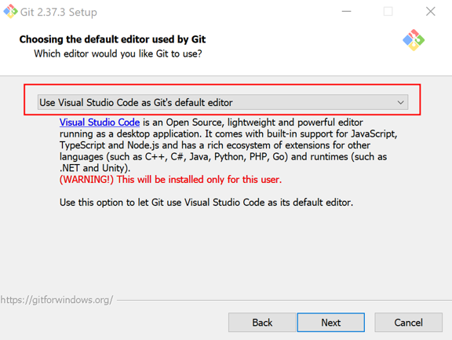
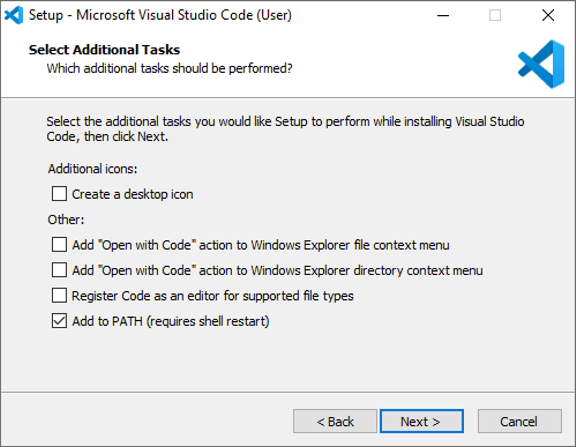
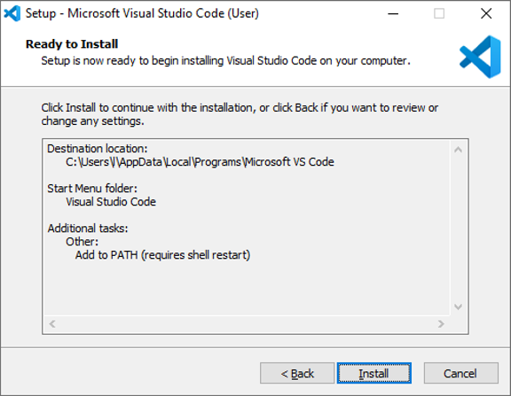
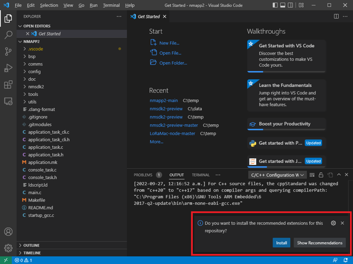
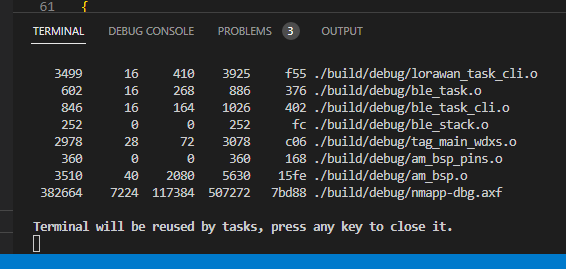
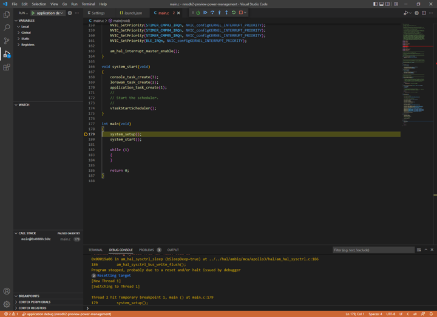

# Northern Mechatronics Application Template 2.0


## Overview
This template application aims to provide a framework for IoT applications using the NM180100 and NMSDK2.  Developers are encouraged to utilize this template as a starting point for their application development.

This application template instantiates the LoRaWAN stack and a BLE stack with the over-the-air firmware update profile.

A serial command line interface (CLI) is also provided; allowing low level control of various hardware peripherals and communication stacks operations during runtime.  On the NM180100EVB evaluation board, the serial CLI can be operated in tandem with the built-in J-Link debugger over a single USB connection.

</br>

## Pre-requisites 
### Hardware
* An NM180100EVB evaluation board
* A USB to micro-USB cable to connect the board
* A Linux or Windows machine

### Software
* ARM GNU Toolchain Compiler
* Segger J-Link software
* Python
* Git
* make
* CMake
* Visual Studio Code (Optional)

<details>

<summary><b>Expand for the detailed software installation instructions </b></summary>

</br>

### Install ARM GNU Toolchain
The ARM GNU Toolchain is used for compiling and building.

<a href="https://developer.arm.com/downloads/-/arm-gnu-toolchain-downloads" target="_blank"><b>Download ARM GNU Toolchain</b></a>

<details>

<summary>Windows</summary>

1. Download and install the Windows hosted cross toolchains.
 
> arm-gnu-toolchain-11.3.rel1-mingw-w64-i686-arm-none-eabi.exe
 
2. Add the compiler to your PATH using the **Add path to environment variable** checkbox.



</details>

<details>

<summary>Linux</summary>

1. Download the Linux hosted cross toolchains

> arm-gnu-toolchain-11.3.rel1-x86_64-arm-none-eabi.tar.xz

2. Extract the toolchain files to the directory where it will be stored.  For example, to install the toolchain to `/opt` type the following

``` sudo tar -xvf arm-gnu-toolchain-11.3.rel1-x86_64-arm-none-eabi.tar.xz -C /opt```

3. Add the compiler to your PATH.
</details>

***
</br>

### Install SEGGER J-Link
SEGGER J-Link is used to program and debug the NM180100EVB board.

<a href="https://www.segger.com/downloads/jlink/#J-LinkSoftwareAndDocumentationPack" target="_blank"><b>Download J-Link Software and Documentation Pack</b></a>

<details>
<summary>Details</summary>

1. Download the J-Link Software and Documentation pack
Download the official J-Link Software and Documentation pack. The exact version will depend on your operating system. Download the version that applies to your operating system. 

2. Add J-Link to your PATH.
</details>

***
</br>

### Install Python

<details>

<summary>Windows</summary>

1. Download the latest version of Python 3 from the <a href="https://www.python.org/downloads/windows/" target="_blank">Downloads page</a>. 

2. Use the Installation Wizard to add Python 3 to your PATH. 



3. Verify that the installation was successful by running the following command in a command prompt:

``` python --version ```

</details>

<details>
<summary>Linux</summary>

Python is usually pre-installed in Linux.  If not, you can run the following command in a terminal to install Python

``` sudo apt-get install python3 ```

</details>

***
</br>

### Install Git

<details>
<summary>Windows</summary>

1. Download Git from <a href="https://git-scm.com/downloads" target="_blank">Git Downloads</a>.
2. Install the appropriate version for your operating system.
3. Select VS Code as the Git’s default editor if you are developing with Visual Studio Code



4. Leave all other settings as default for the rest of the install options.
</details>

<details>

<summary>Linux</summary>

Install git by entering the following command in a terminal:

``` sudo apt-get install git ```

</details>

***
</br>

### Install Make

<details>

<summary>Windows</summary>

1. Install MSYS2 on your machine by following the <a href="https://www.msys2.org/" target="_blank">MSYS2 Getting Started guide</a>.

2. Add MSYS2 to your PATH.  The default location for Windows 64-bit is `C:\msys64\usr\bin`

3. Open the MSYS2 shell and type the following command:

``` pacman -S make ```

4. Enter `Y` if prompted.  This will install make on your windows machine.
</details>

<details>
<summary>Linux</summary>
Make is usually pre-installed in Linux.  If not, enter the following command in a terminal:

``` sudo apt-get install make ```

</details>

***
</br>

### Install CMake

<details>

<summary>Windows</summary>

1. Download the CMake Installer binary from https://cmake.org/download/

2. Run the installer and follow the on-screen instructions to complete installation.

3. During installation, ensure that the option to modify the system PATH environment variable is selected.

</details>

<details>
<summary>Linux</summary>

1. Uninstall the default version using

``` sudo apt remove --purge --auto-remove cmake```

2. Add kitware's signing key

``` wget -O - https://apt.kitware.com/keys/kitware-archive-latest.asc 2>/dev/null | gpg --dearmor - | sudo tee /etc/apt/trusted.gpg.d/kitware.gpg >/dev/null ```

3. Add kitware's repository

``` sudo apt-add-repository "deb https://apt.kitware.com/ubuntu/ $(lsb_release -cs) main" ```

4. Install cmake

```
sudo apt update
sudo apt install cmake
```

</details>

***
</br>

### Install Visual Studio Code (Optional)
Microsoft Visual Studio Code (VS Code) is a source-code editor made by Microsoft for Windows, Linux, and macOS. This application template has been pre-configured to work with the VS Code interface. 

<details>

<summary>Windows</summary>

1. Download the latest version of VS Code from the <a href="https://code.visualstudio.com/Download/" target="_blank">Download page</a>. Choose the correct version for your operating system.

2. On the **Select Additional Tasks** screen of the installation wizard, enable the **Add to PATH (requires shell restart)** checkbox. 



3. Click the **Install** button. 



4. VS Code should now be installed.

</details>

<details>
<summary>Linux</summary>

1. Update the system repository by running the following command:

``` sudo apt update ```

2. Install the package dependencies:

``` sudo apt install software-properties-common apt-transport-https wget -y ```

3. Add GPG Key:

``` wget -q https://packages.microsoft.com/keys/microsoft.asc -O- | sudo apt-key add - ```

4. Add the repository:

``` sudo add-apt-repository "deb [arch=amd64] https://packages.microsoft.com/repos/vscode stable main" ```

5. Install vscode:

``` sudo apt install code ```

6. Verify the installation by running:

``` code --version ```
</details>

</details>

</br>

## Clone the Repositories
<details>

<summary> Command Line </summary>
Clone and install nmapp2 and nmsdk2.

```
git clone --recursive https://github.com/NorthernMechatronics/nmapp2.git
```

</details>

<details>

<summary> VS Code </summary>

To clone the repositories directly within VS Code:

1. Open the command palette with the key combination of Ctrl + Shift + P.

2. Type `gitcl` in the command palette, select the **Git: Clone (Recursive)** command, and press Enter.

3. When prompted for the **Repository URL**, select clone from GitHub, then press Enter.

4. If you are asked to sign into GitHub, complete the sign-in process using your github account credential.

5. Enter the repository URL in the **Repository URL** field.

``` https://github.com/NorthernMechatronics/nmapp2.git ```

6. Select (or create) the local directory into which you want to clone the project.

7. When you receive the notification asking if you want to open the cloned repository, select Open.

8. When the folder is opened, pop-up messages may appear asking you to install the recommended extensions.  They are required to build and debug your project from within the VS Code environment. 



9. If no pop-up appears, follow these instructions to install our recommended extensions:
    1. Open the nmapp2 folder in VS Code.
    2. Click the **Extensions** icon on the left.
    3. In the search box that shows the prompt **Search Extensions in Marketplace**, enter the text “@recommended”. 
    4. If you cannot view these items listed in your workspace, manually install the following extensions:
        * C/C++
        * C/C++ Extensions
        * C/C++ Themes
        * Makefile Tools
        * Cortex-Debug
        * LinkerScript

</details>

</br>

## Build the Application

<details>

<summary> Command Line </summary>
You can build the project and the SDK by entering the following commands in a terminal.

```
cd nmapp2
make all
```

</details>

<details>

<summary> VS Code </summary>

To build within VS Code, press `CTRL+SHIFT+B` and select **build all**.  Alternatively, click on **Terminal** in the menu bar, then click on **Run Build Task...**, and finally select **build all**.

This will build the entire SDK and the application for both debug and release mode.  When the build completes and is successful, the output operation should resemble the following image:



There are three build options pre-defined in VS Code.  They are **build all**,
**build debug**, and **build release**.  The build process generates all the
output under the `./build/debug` and `./build/release` directories respectively
for the debug and the release configuration.  Debug output has the suffix `-dbg`
whereas release output has the suffix `-rel`.  In this example, they are:
* nmapp-dbg.axf
* nmapp-rel.axf

</details>

</br>

## Flash and Debug
During the build step, an additional binary file is generated with the
extension `.bin` in each configuration (nmapp-dbg.bin and nmapp-rel.bin).
This is the file that will be flashed on to the evaluation board.

Before flashing, make sure that the NM180100EVB is attached to the host computer with the USB cable and the power switch is turned on.  The blue LED
beside the reset button is lid indicating that the board is turned on.

<details>

<summary> Command Line </summary>

To flash the binary on to the board:

1. Open a command prompt and change into the project folder.

2. In this example, we will use the debug configuration.  Type the following command:
```
cd build
cd debug
jlink
```
3. Follow the instructions in the J-Link prompt:
```
SEGGER J-Link Commander V7.64e (Compiled May 10 2022 14:53:03)
DLL version V7.64e, compiled May 10 2022 14:51:44

Connecting to J-Link via USB...O.K.
Firmware: J-Link OB-K22-Cortex-M compiled May  2 2022 09:04:12
Hardware version: V1.00
S/N: 900002190
USB speed mode: Full speed (12 MBit/s)
VTref=3.300V


Type "connect" to establish a target connection, '?' for help 
J-Link>
```
4.  Type `connect` and press ENTER when prompted:
```
Type "connect" to establish a target connection, '?' for help 
J-Link> connect
Please specify device / core. <Default>: AMA3B1KK-KBR
Type '?' for selection dialog
Device>
```

5.  When prompted for the device, type `AMA3B1KK-KBR` and press ENTER:
```
Please specify device / core. <Default>: AMA3B1KK-KBR
Type '?' for selection dialog
Device>AMA3B1KK-KBR
Please specify target interface:
  J) JTAG (Default)
  S) SWD
  T) cJTAG
TIF>
```  

6. Type `SWD` for the target interface:
```
Please specify target interface:
  J) JTAG (Default)
  S) SWD
  T) cJTAG
TIF>SWD
Specify target interface speed [kHz]. <Default>: 4000 kHz
Speed>
```

7.  Press `ENTER` to accept the default speed of 4000kHz.  You should be presented with an output similar to the following:
```
Device "AMA3B1KK-KBR" selected.


Connecting to target via SWD
Found SW-DP with ID 0x2BA01477
DPIDR: 0x2BA01477
CoreSight SoC-400 or earlier
Scanning AP map to find all available APs
AP[1]: Stopped AP scan as end of AP map has been reached
AP[0]: AHB-AP (IDR: 0x24770011)
Iterating through AP map to find AHB-AP to use
AP[0]: Core found
AP[0]: AHB-AP ROM base: 0xE00FF000
CPUID register: 0x410FC241. Implementer code: 0x41 (ARM)
Found Cortex-M4 r0p1, Little endian.
FPUnit: 6 code (BP) slots and 2 literal slots
CoreSight components:
ROMTbl[0] @ E00FF000
[0][0]: E000E000 CID B105E00D PID 000BB00C SCS-M7
[0][1]: E0001000 CID B105E00D PID 003BB002 DWT
[0][2]: E0002000 CID B105E00D PID 002BB003 FPB
[0][3]: E0000000 CID B105E00D PID 003BB001 ITM
[0][4]: E0040000 CID B105900D PID 000BB9A1 TPIU
Cortex-M4 identified.
J-Link>
```

8.  Load the binary by typing `loadbin nmapp-dbg.bin, 0xc000`.  This will flash the binary file to address 0xC000 which is the first execution address after the bootloader runs.
```
J-Link>loadbin nmapp-dbg.bin, 0xc000
Halting CPU for downloading file.
Downloading file [nmapp-dbg.bin]...
J-Link: Flash download: Bank 0 @ 0x0000C000: 1 range affected (401408 bytes)
J-Link: Flash download: Total: 3.700s (Prepare: 0.120s, Compare: 0.058s, Erase: 0.769s, Program & Verify: 2.695s, Restore: 0.057s)
J-Link: Flash download: Program & Verify speed: 145 KB/s
O.K.
```

9. Once flashing is completed, you can start the execution with the commands `r` and then `g` which stand for reset and go.
```
J-Link>r
Reset delay: 0 ms
Reset type NORMAL: Resets core & peripherals via SYSRESETREQ & VECTRESET bit.
ResetTarget() start
JDEC PID 0x000000CF
Ambiq Apollo3 ResetTarget
Bootldr = 0x44000000
Secure Part.
Secure Chip. Bootloader needs to run which will then halt when finish.
CPU halted after reset. TryCount = 0x00000000
ResetTarget() end
J-Link>g
J-Link>
```

10. Exit J-Link using the command `q`.

</details>

<details>

<summary> VS Code </summary>

To flash and debug in VS Code, simply:

1. Select **Run** in the menu bar.

2. Then click on **Start Debugging**.  This will flash the binary onto the device and begin debugging.

3. The screen should look like the following when the debugger starts:



</details>
