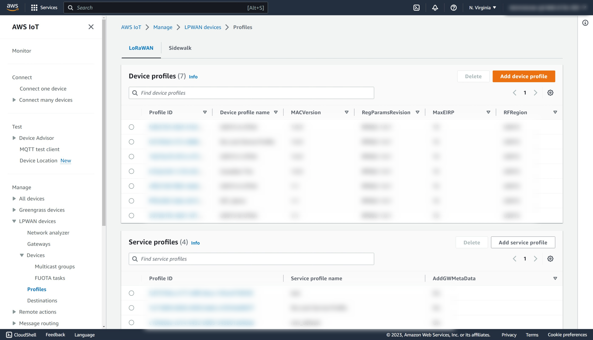
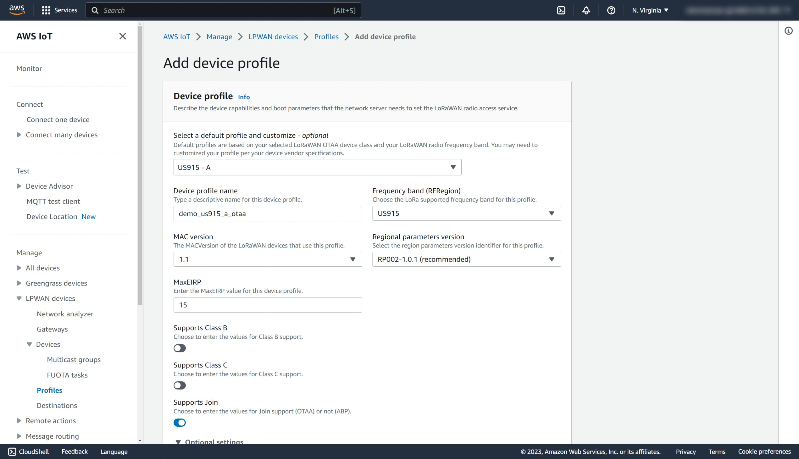
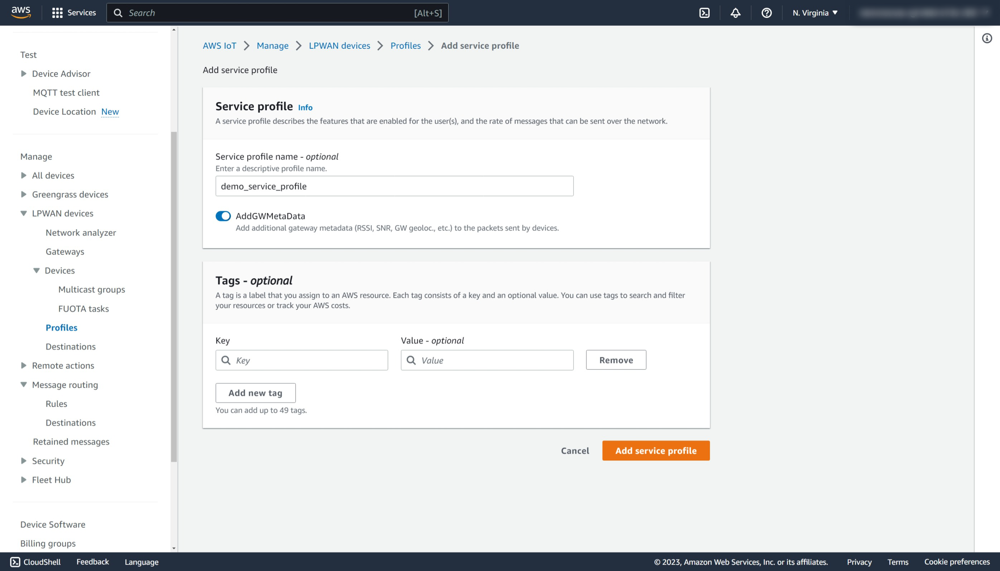
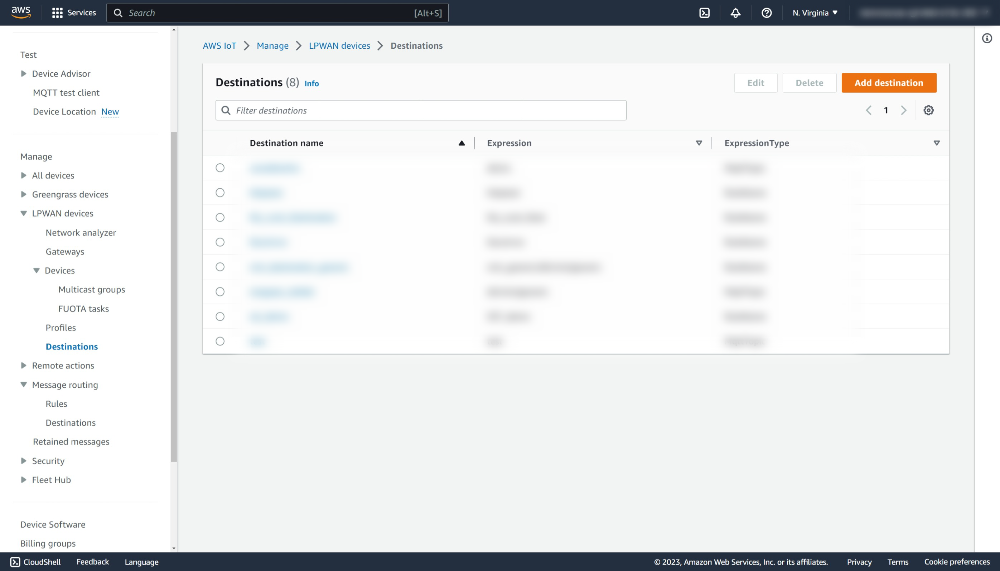
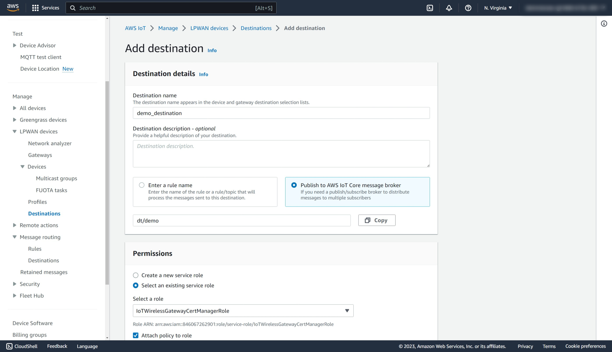
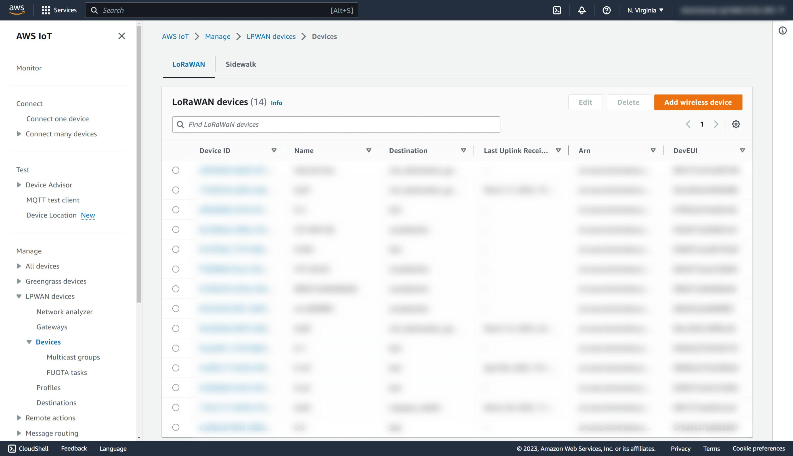
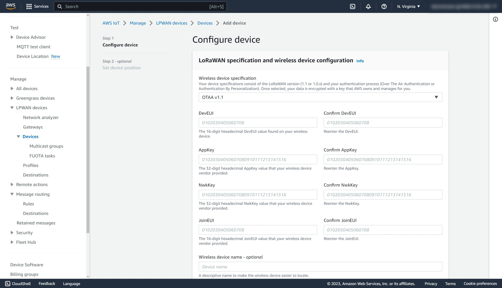

# Adding a Device to AWS IoT

## Pre-requisites

- a LoRaWAN device powered by the NM180100 such as the NM180100EVB.
- the NM180100 device is running the LoRaWAN protocol stack provided in NMSDK2.

## Profile Configuration

Device and service profiles define common device configurations and are shared
by multiple devices. Multiple profiles can exist to support different devices.

### Device Profile Creation

1. Login to AWS and type `IoT Core` in the search bar at the top.
2. Select **IoT Core** in the search result to access the AWS IoT console.
3. Select **LPWAN devices** in the left panel to expand the menu.
4. Select **Profiles** in the submenu.
5. Click on **Add device profile**.
   
6. In the **Select a default profile and customize** drop down box, select a default profile as a starting point. In this example, we will be using US915-A for the 900MHz ISM Band Class A operation in North America.
7. Enter a profile name. In this example, we will use `demo_us915_a_otaa`.
8. Select US915 in **Frequency band**.
9. Select 1.1 in **MAC version**.
10. Leave the **Regional parameters version** to the default. RP002-1.0.1 at the time of this writing.
11. Change MaxEIRP to 15. This parameter refers to the maximum radiated power which is the logarithmic sum of the conducted power and the maximum antenna gain. For the NM180100, the conducted power is around 21.5dBm at the antenna pin. If the maximum antenna gain is 2dBi, then the EIRP of this device is 23.5dBm. At the time of this writing, AWS restricts this entry to a value less than 16. This does not impact device performance and is used by the link control algorithm of the LoRaWAN Network Server to determine the optimal modulation parameters.
12. Enable additional classes if your application supports them. While the NMSDK2 supports all three classes, Class B operation requires support from the gateway manufacturer as a Class B gateway requires a GPS and the concentrator chip must be provided with a GPS derived pps clock. In this example, we will leave both Class B and C disabled.
13. Ensure **Supports Join** is selected which enables over the air activation.
14. Ensure that **Supports 32-bit FCnt** is enabled.
15. Click **Add device profile** to finish.
    

### Service Profile Creation

1. In the IoT console, select **LPWAN devices** on the left panel to expand the menu.
2. Select **Profiles** in the submenu.
3. Click on **Add service profile** in the Service profiles section.
4. Enter a name for this service profile. In this example, we will use `demo_service_profile`.
5. Leave **AddGWMetaData** enabled.
6. Click **Add service profile** to save and exit.
   

## Destination Configuration

1. In the IoT console, select **LPWAN devices** on the left panel to expand the menu.
2. Select **Destinations** in the submenu.
3. Click **Add destination**.
   
4. Enter a name for **Destination name**. In this example, we will use `demo_destination`.
5. Select **Publish to AWS IoT Core message broker**. This options will route a LoRaWAN message to an MQTT topic.
   For more complicated message routing scenarios such as routing to other AWS services or external providers, please follow the
   <a href="https://docs.aws.amazon.com/iot/latest/developerguide/iot-rules-tutorial.html">AWS Developer Guide</a>.
6. Provide a name for the MQTT topic. In this example, we will use `dt/demo`.
7. In the Permissions section, select **Select an existing service role**.
8. Select the role `demo_destination_role` created during [IAM Policy and Role for LoRaWAN Messages](aws_iot_core_integration.md#iam-policy-and-role-for-lorawan-messages).
9. Leave **Attach policy to role** checked.
10. Click **Add destination** to save and exit.
    

## Add a LoRaWAN Device to AWS IoT Core

1. In the IoT console, select **LPWAN devices** on the left panel to expand the menu.
2. Select **Devices** in the submenu.
3. Click **Add wireless device**.
   
4. In the **Wireless device specification** drop down box, select **OTA v1.1**. This should match the device profile parameters from [Device Profile Creation](#device-profile-creation). In this case, the are LoRaWAN version 1.1 and over the air activation enabled.
5. Enter the DevEUI, AppKey, NwkKey, and the JoinEUI. On the NM180100EVB running nmapp2, these values can be displayed using the command

```
lorawan keys
```

6. Enter a Wireless device name.
7. Expand the FUOTA configuration section. This section specifies the settings for firmware update over the air which is supported by NM180100. Ensure that **This device supports firmware update over the air (FUOTA)** is enabled. Leave all the port numbers to the default. This will be used in other tutorials.
8. In the Thing association section, disable associate a thing with your wireless device if you are not using fleet management.
9. In the Profiles section, select `demo_us915_a_otaa` created in [Device Profile Creation](#device-profile-creation) and
   `demo_service_profile` created in [Service Profile Creation](#service-profile-creation).
10. In the Choose destination section, select `demo_destination_role` created in [Destination Configuration](#destination-configuration).
11. Click **Next**.
    
12. Leave all entries empty unless you are using geolocation solver (this is a paid service). Click **Add device**.
