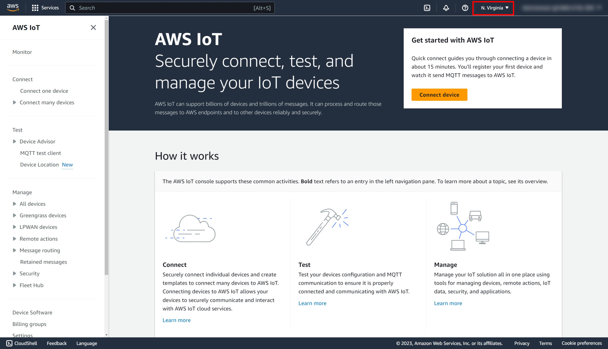
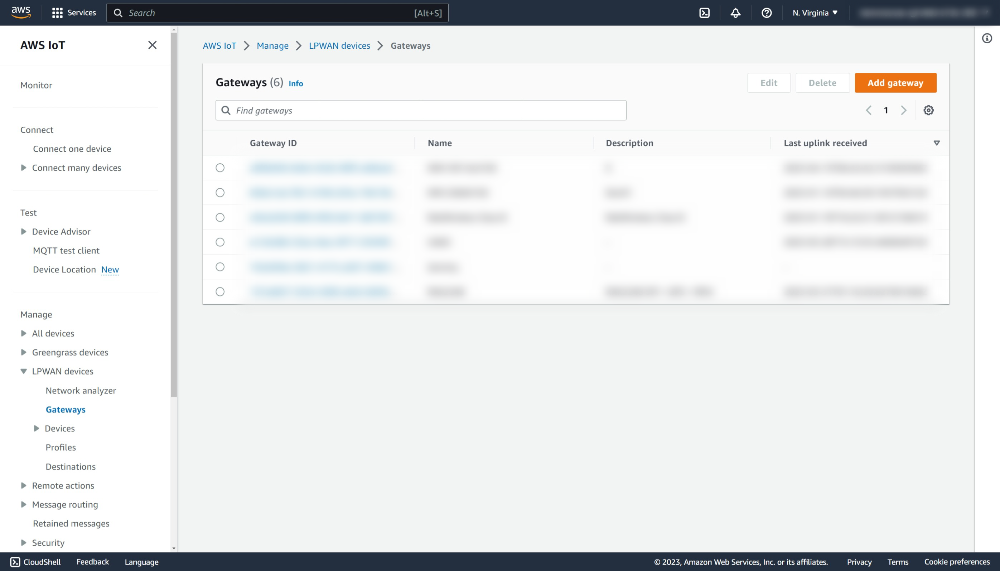
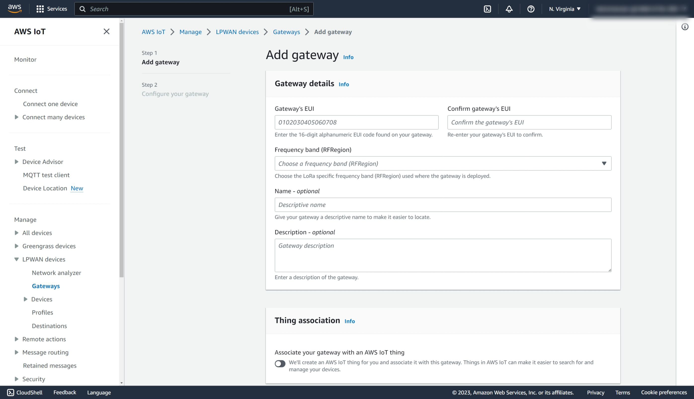
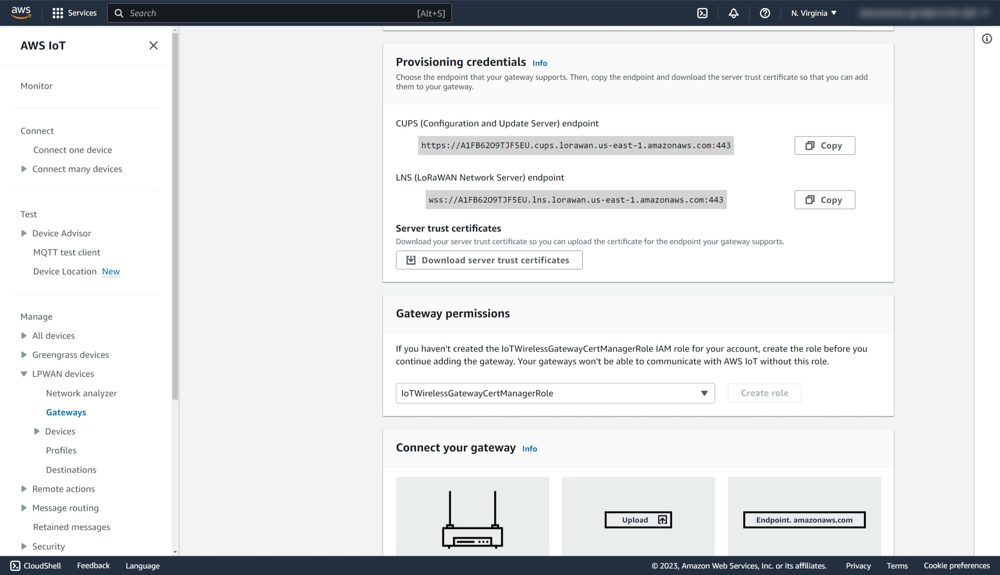

# Adding a Gateway to AWS IoT

1. Login to AWS and type `IoT Core` in the search bar at the top.
2. Select **IoT Core** in the search result to access the AWS IoT console.
3. Examine the left panel and ensure that the option **LPWAN devices** is avaialble.
   If not, change the region at the top right corner to one where LoRaWAN is supported.
   At the time of this writing, both us-east-1 (N. Virginia) and us-west-2 (Oregon) support LoRaWAN.
   
4. Select **LPWAN devices** in the left menu bar to expand the menu.
5. Select **Gateways** in the submenu.
6. Click on **Add gateway**.
   
7. Fill in the Gateway EUI (refer to the gateway manual) and the frequency band for your region of operation.
8. Fill in the name if desired.
9. Uncheck **Associate your gateway with an AWS IoT thing** if you do not use the fleet management feature.
10. Click on **Add gateway**.
    
11. On the **Configure your Gateway** page, find the section titled Gateway certificate and click on **Create certificate**.
12. This will generate a certificate file and a key file which will be used by Basic Station in your LoRaWAN gateway to connect to CUPS.
13. Click on **Download certificate files** and save them to your computer.
    
14. In the section Provisioning Credentials, click on **Download server trust certificates** to download the CUPS and LNS server trust certificates.
15. Copy the CUPS and LNS endpoints and save them for use when configuring your LoRaWAN gateway.
16. In the section Gateway permissions, select **IotWirelessGatewayCertManagerRole** that you have created during [IAM Policy and Role Creation for CUPS](aws_iot_core_integration.md#iam-policy-and-role-creation-for-cups) step.
17. Click on **Submit** to add the gateway to AWS IoT Core.
    

## Configure Gateway to Commmunicate with AWS IoT Core

Follow the manufacturer instructions of your gateway to configure and connect the gateway to AWS.  Note that network administrator access maybe required to add the gateawy to your organization's network.
