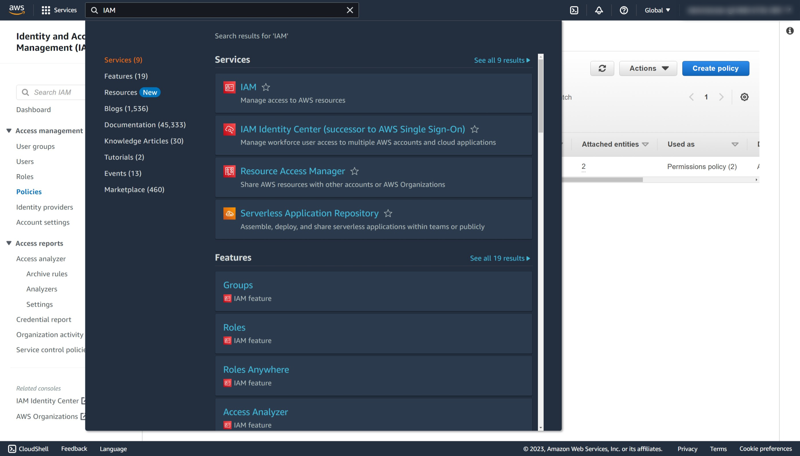
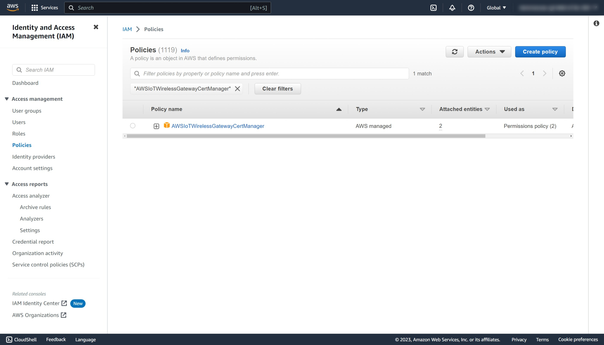
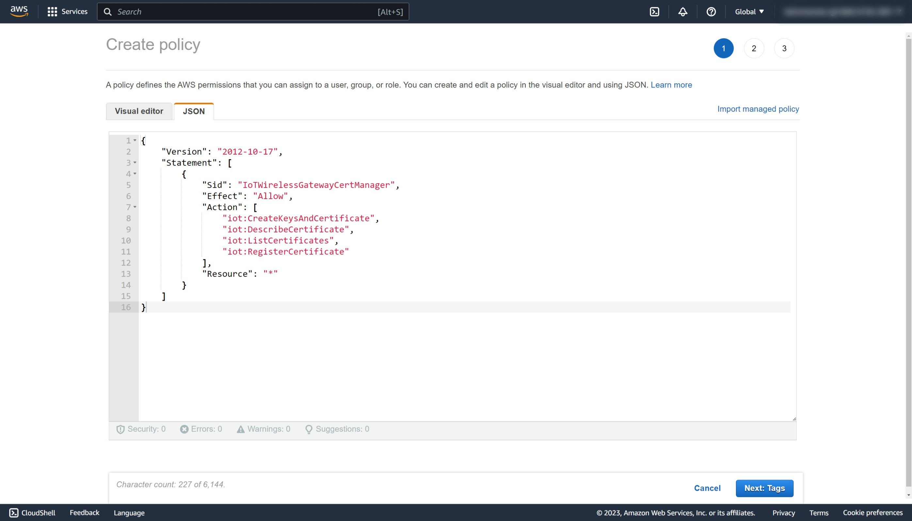
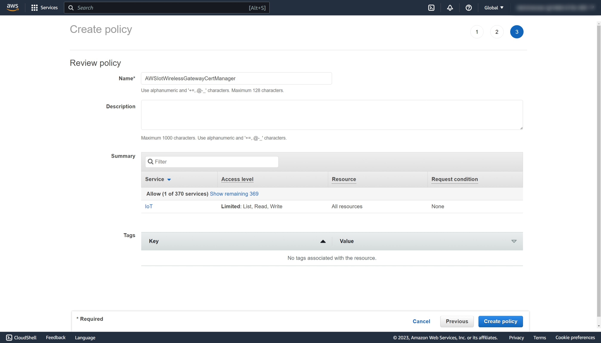
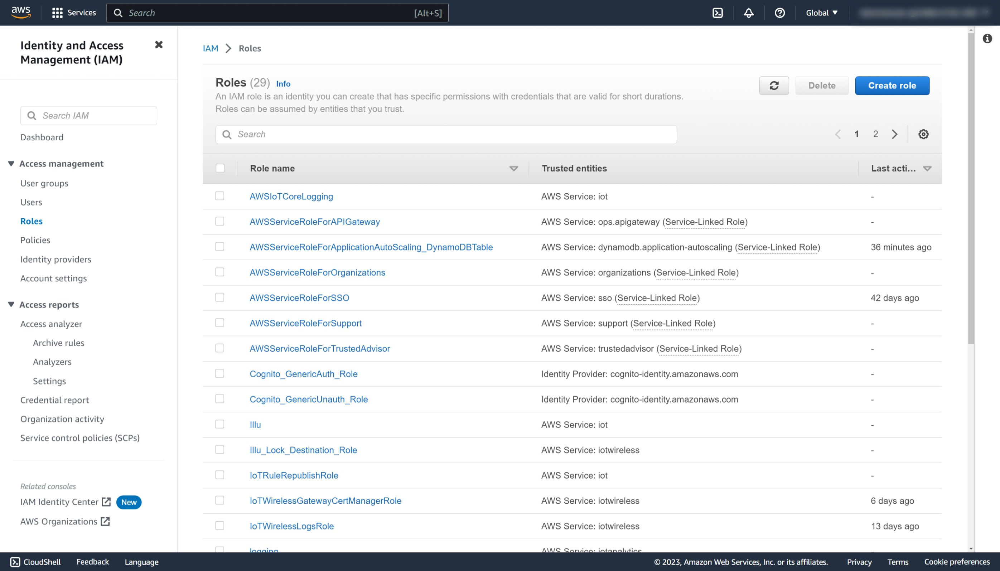
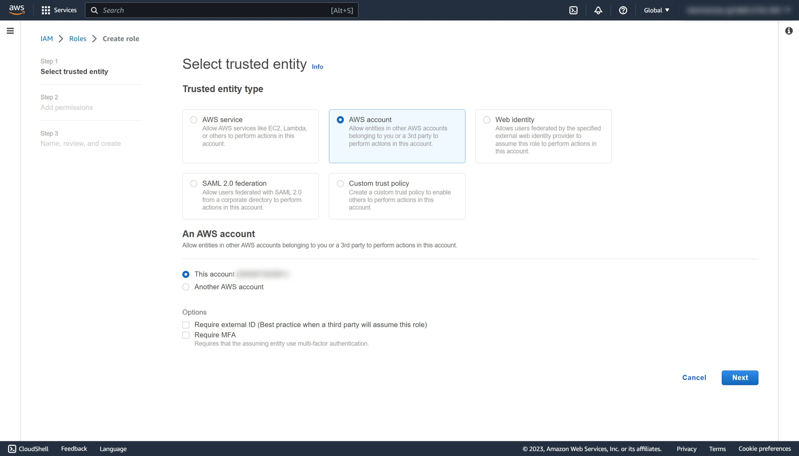
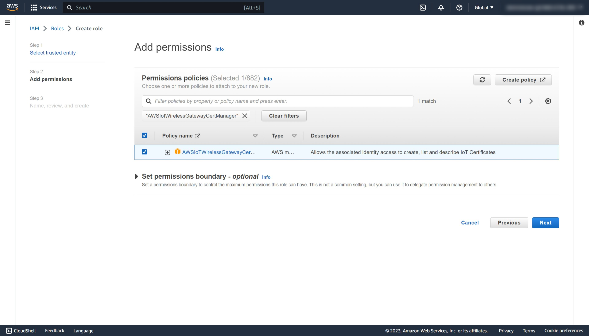
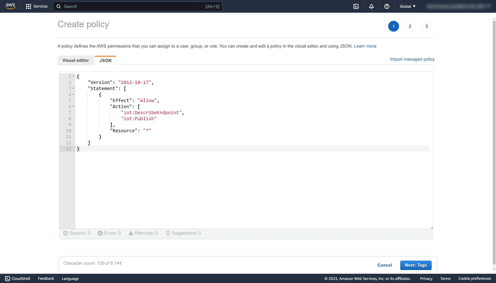
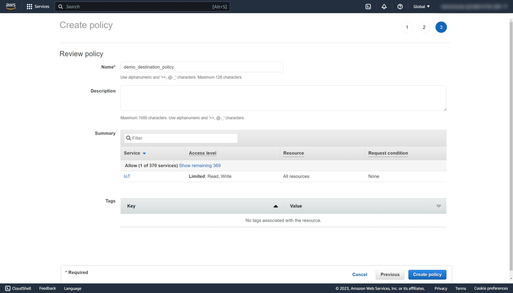

# AWS IoT Core Integration

## Overview

This guide provides instructions on how to connect the NM180100 to the AWS IoT Core.

## Pre-requisites

- A LoRaWAN end-node such as the NM180100EVB.
- A LoRaWAN gateway with support for Basic Station.
- An AWS <a href="https://signin.aws.amazon.com">account</a>.

---

## AWS Identity and Access Management (IAM) Configuration

<details>

<summary> IAM Policy and Role Creation for CUPS (expand for detailed instructions) </summary>

### IAM Policy and Role Creation for CUPS

#### Overview

This section outlines the steps to allow the Configuration and Update Server (CUPS) to handle wireless gateway credentials. This procedure only needs to be done once and must be performed before a LoRaWAN gateway can be added to the AWS IoT Core.

#### Setup Policy

1. Login to AWS and type IAM in the search bar at the top.
2. Select **IAM** in the search result to access the IAM console.
   
3. In the IAM console, select **Policies** in the left panel.
4. In the search box next to **Filter policies**, enter `AWSIotWirelessGatewayCertManager`.
   
5. If the search result is empty, click on **Create policy** and continue with the next step. Otherwise skip to [Setup Role](#setup-role)
6. Select the **JSON** tab and replace the content with the following:

   ```
   {
       "Version": "2012-10-17",
       "Statement": [
           {
               "Sid": "IoTWirelessGatewayCertManager",
               "Effect": "Allow",
               "Action": [
                   "iot:CreateKeysAndCertificate",
                   "iot:DescribeCertificate",
                   "iot:ListCertificates",
                   "iot:RegisterCertificate"
               ],
               "Resource": "*"
           }
       ]
   }
   ```

   

7. Click on **Next: Tags** and then **Next: Review**.
8. On the Review policy page and in text box next to **Name**, enter `AWSIotWirelessGatewayCertManager`.

   

9. Click **Create policy** and a confirmation message pops up showing that the policy has been created.

#### Setup Role

10. Back in the IAM console, select **Roles** in the left panel.
    
11. Click on **Create role** at the top right corner.
12. On the Create role page, choose **AWS account**.
13. Select **This account (xxxxxxxxxxxx)**.
14. Select **Next**.
    
15. In the search box next to **Filter policies**, enter `AWSIotWirelessGatewayCertManager`.
16. Select the policy by clicking on the checkbox. Click **Next**.
    
17. In the textbox beside **Role name**, enter `IotWirelessGatewayCertManagerRole`. Note that this must have a different name than the policy name.
18. Select **Create role** and a confirmation message will show indicating that the role has been created.

#### Update Trust Relationship

19. Back in the IAM console, select **Roles** again.
20. Enter `IotWirelessGatewayCertManagerRole` in the search box or the name that you have choosen in the previous section.
21. Select the **Trust relationships** tab, and click on **Edit trust policy**.
22. Replace the content with the following:

```
{
    "Version": "2012-10-17",
    "Statement": [
        {
            "Effect": "Allow",
            "Principal": {
                "Service": "iotwireless.amazonaws.com"
            },
            "Action": "sts:AssumeRole"
        }
    ]
}
```

23. Click **Update Policy** to save your changes and exit.

</details>

<details>
<summary> IAM Role and Policy for LoRaWAN Messages (expand for detailed instructions) </summary>

### IAM Policy and Role for LoRaWAN Messages

#### Overview

This section outlines the steps needed to create the role and policy needed to publish messages to AWS IoT.

#### Setup Policy

1. In the IAM console, select **Policies** in the left menu bar.
2. Click on **Create policy**.
3. Select the **JSON** tab and replace the existing content with the following:

   ```
   {
       "Version": "2012-10-17",
       "Statement": [
           {
               "Effect": "Allow",
               "Action": [
                   "iot:DescribeEndpoint",
                   "iot:Publish"
               ],
               "Resource": "*"
           }
       ]
   }
   ```

   

4. Click on **Next: Tags** and then **Next: Review**.
5. On the Review policy page and in text box next to **Name**, enter a name of your choice. In this example, we will use `demo_destination_policy`.
6. Select **Create policy** and a confirmation message pops up showing that the policy has been created.
   

#### Setup Role

7. Back in the IAM console, select **Roles** in the left menu bar.
8. Click on **Create role** at the top right corner.
9. On the Create role page, choose **AWS account**.
10. Select **This account (xxxxxxxxxxxx)**.
11. Select **Next**.
    
12. In the search box next to **Filter policies**, enter `demo_destination_policy` or the name that you have choosen during the policy creation step.
13. Select the policy by clicking on the checkbox. Select **Next: Tags** and then **Next: Review**.
14. In the textbox beside **Role name**, enter a name of your choice. In this example, we will use `demo_destination_role`.
15. Select **Create role** and a confirmation message will show indicating that the role has been created.

#### Update Trust Relationship

19. Back in the IAM console, select **Roles** again.
20. Enter `demo_destination_role` in the search box or the name that you have choosen in the previous section.
21. Choose **demo_destination_role** in the result to edit the role.
22. Select the **Trust relationships** tab, and click on **Edit trust policy**.
23. Replace the content with the following:

```
{
    "Version": "2012-10-17",
    "Statement": [
        {
            "Effect": "Allow",
            "Principal": {
                "Service": "iotwireless.amazonaws.com"
            },
            "Action": "sts:AssumeRole",
            "Condition": {}
        }
    ]
}
```

24. Click **Update Policy** to save your changes and exit.

</details>
